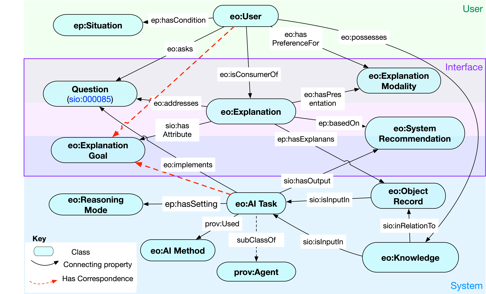

<h1 class="page-title" style="text-transform:uppercase;" id="header">EXPLANATIONS ONTOLOGY: TREATING EXPLANATIONS AS A PRIMARY CONSIDERATION</h1>
<h3 style="color:dimgrey;">Shruthi Chari1, Oshani Seneviratne1, Daniel M. Gruen2, Morgan Foreman2, Deborah L. McGuinness1, Amar K. Das2</h3>
<h3><a href="https://www.rpi.edu/">1Rensselaer Polytechnic Institute</a> | <a href="https://www.research.ibm.com/labs/cambridge/">2IBM Research, Cambridge</a></h3>

A website to navigate resources open-sourced via the associated ISWC 2020 submission

<!-- <table>
  <tbody>
    <tr>
      <td><a href="#abstract">Abstract</a></td>
    </tr>
  </tbody>
</table> -->

<article class="mb-5" id="abstract">
<content>
  
  
<h2>Abstract</h2>
  
Explainability has been a goal for Artificial Intelligence systems since their conception, with the need for explanations only growing as machine learning models are increasingly used in critical settings such as healthcare. Currently, explanations are often treated as a nice-to-have feature added in a post-hoc manner. With greater adoption of these systems and emphasis on user-centric explainability, there is a need for a structured representation that treats explainability as a primary consideration, mapping end user needs to specfic explanation types. We design an explanations ontology to formalize the generation of explanations in a machine-readable format, accounting for the system and user attributes in the process. Within our ontology, we support the modeling of different literature-derived explanation types, whose requirements and generational needs were further refined through a requirements gathering exercise conducted with clinicians. Through this ontology, we hope to benefit system designers to include explanation generation facilities in their systems. We evaluate our ontology via competency questions that are inspired by learnings from our clinical requirements gathering exercise and are geared towards a system designer who might use our ontology to learn about the best explanation types to include, given a combination of users' needs and a system's capabilities, both in real-time and system design settings.

<ul>
  
 </ul>
 </content>
 
 <article class="mb-5" id="resources">
<content>
<h2>List of Resources </h2>
<ul>
 <table style="width:100%">
    <tr>
    <th>Resources</th>
    <th>Links</th> 
  </tr>
  <tr>
    <td>1. Ontology:</td>
    <td>(a) <a href="index#ontology">Explanations Ontology</a> </td> 
  </tr>
  <tr>
    <td>2. Modeling Snippets:</td>
    <td>(a) <a href="index#explanationtypes">Explanation Types</a> </td> 
  </tr>
    <!--<tr>
    <td> </td>
    <td> (b) <a href="./application.html">Faceted Browser</a> </td> 
  </tr>-->
    <tr>
    <td></td>
    <td>(b) <a href="index#clinical">Example of a Contrastive Explanation</a> </td> 
  </tr>
   <tr>
    <td>3. Competency Questions </td>
    <td> (a) <a href="index#sparql">SPARQL Queries</a> </td> 
  </tr>
</table>
  
 </ul>
 </content>
 
 <article class="mb-5" id="ontology">
<content>
  
  
<h2>Explanations Ontology</h2>
  
We have designed an explanations ontology that captures the aspects of explanations related to their generation from a system's perspective while accounting for factors from an end-user's perspective. Through our modeling of the components involved in the process of explanation generation, we provide a means for system designers to translate their user requirements gathered from user studies to explanations that can be generated by their systems. We depict how our ontology schema can support the modeling of different literature-derived explanation types that help address the diverse needs of user-centric explainability.

  
  <figure>
  
  <figcaption>A conceptual overview of our <strong>Explanations Ontology</strong> with the relationships between the main classes highlighted. We have used color shading in this diagram to depict the separation between user, system and interface attributes. The interface attributes are those which would be visible to the end-user via system's views.</figcaption>
  </figure>
  
  <h3 id="ontologylinks">Ontology Links</h3>
  <ul>
  <li>Ontology documentation generated using the <a href="https://github.com/dgarijo/Widoco">Widoco</a> tool can be browsed at: <a href="https://tetherless-world.github.io/explanations-ontology/WidocoDocumentation/index-en.html">https://tetherless-world.github.io/explanations-ontology/WidocoDocumentation/index-en.html</a></li>
  <li>Ontology can be accessed from <a href="https://purl.org/heals/eo">https://purl.org/heals/eo</a></li>
  </ul>
  <!--<iframe src="https://tetherless-world.github.io/explanations-ontology/WidocoDocumentation/index-en.html" style="width:100%;"/>-->
 </content>
 
<!-- 

  
  

    <h1 class="post-title">
      <a href="{{ post.url }}">
        {{ post.title }}
      </a>
    </h1>

    {{ post.date | date_to_string }}

    {{ post.content }}
  

  

  
    <a class="pagination-item older" href="{{ site.baseurl }}page{{paginator.next_page}}">Older</a>
  
    Older
  
  
    
      <a class="pagination-item newer" href="{{ site.baseurl }}">Newer</a>
    
      <a class="pagination-item newer" href="{{ site.baseurl }}page{{paginator.previous_page}}">Newer</a>
    
  
    Newer
  

 -->
