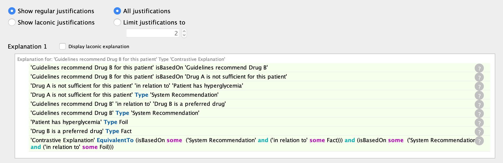

<h1 class="page-title" style="text-transform:uppercase;" id="header">EXPLANATIONS ONTOLOGY: MODELING EXPLAINABILITY IN A USER-CENTERED AI SYSTEM DESIGN</h1>
<h3 style="color:dimgrey;">Shruthi Chari1, Oshani Seneviratne1, Daniel M. Gruen2, Morgan Foreman2, Deborah L. McGuinness1, Amar K. Das2</h3>
<h3><a href="https://www.rpi.edu/">1Rensselaer Polytechnic Institute</a> | <a href="https://www.research.ibm.com/labs/cambridge/">2IBM Research, Cambridge</a></h3>

A website to navigate resources open-sourced via the associated ISWC 2020 submission. Use the side navigation panel to explore different sections of the website and click on an add symbol for more navigation options under some sections.

<!-- <table>
  <tbody>
    <tr>
      <td><a href="#abstract">Abstract</a></td>
    </tr>
  </tbody>
</table> -->

<article class="mb-5" id="abstract">
<content>
  
  
<h2>Abstract</h2>
  
Explainability has been a goal for Artificial Intelligence systems since their conception, with the need for explanations only growing as machine learning models are increasingly used in critical settings such as healthcare. Currently, explanations are often treated as a nice-to-have feature added in a post-hoc manner. With greater adoption of these systems and emphasis on user-centric explainability, there is a need for a structured representation that treats explainability as a primary consideration, mapping end user needs to specfic explanation types. We design an explanations ontology to formalize the generation of explanations in a machine-readable format, accounting for the system and user attributes in the process. Within our ontology, we support the modeling of different literature-derived explanation types, whose requirements and generational needs were further refined through a requirements gathering exercise conducted with clinicians. Through this ontology, we hope to benefit system designers to include explanation generation facilities in their systems. We evaluate our ontology via competency questions that are inspired by learnings from our clinical requirements gathering exercise and are geared towards a system designer who might use our ontology to learn about the best explanation types to include, given a combination of users' needs and a system's capabilities, both in real-time and system design settings.

 </content>
 
 

 <article class="mb-5" id="resources">
<content>
<h2>List of Resources </h2>
<ul>
 <table style="width:100%">
    <tr>
    <th>Resources</th>
    <th>Links</th> 
  </tr>
  <tr>
    <td>1. Ontology:</td>
    <td>(a) <a href="index#ontology">Explanations Ontology</a> </td> 
  </tr>
  <tr>
    <td>2. Modeling Snippets:</td>
    <td>(a) <a href="index#explanationtypes">Explanation Types</a> </td> 
  </tr>
    <!--<tr>
    <td> </td>
    <td> (b) <a href="./application.html">Faceted Browser</a> </td> 
  </tr>-->
    <tr>
    <td></td>
    <td>(b) <a href="index#clinicalexample">Example of a Contrastive Explanation</a> </td> 
  </tr>
   <tr>
    <td>3. Competency Questions </td>
    <td> (a) <a href="index#sparql">SPARQL Queries</a> </td> 
  </tr>
   <tr>
    <td>3. Tools Used </td>
    <td> (a) <a href="index#toolsused">References to tools used</a> </td> 
  </tr>
</table>
  
 </ul>
 </content>
 
 

 <article class="mb-5" id="ontology">
<content>
  
  
<h2 id="ontologyabout">Explanations Ontology</h2>
  
Ontology has been cleared for release and is made available as an open-source resource under the <a href="https://www.apache.org/licenses/LICENSE-2.0">Apache 2.0 license</a>

  
We have designed an explanations ontology that captures the aspects of explanations related to their generation from a system's perspective while accounting for factors from an end-user's perspective. Through our modeling of the components involved in the process of explanation generation, we provide a means for system designers to translate their user requirements gathered from user studies to explanations that can be generated by their systems. We depict how our ontology schema can support the modeling of different literature-derived explanation types that help address the diverse needs of user-centric explainability.

  
  <figure>
  
  <figcaption>Fig. 1: A conceptual overview of our <strong>Explanations Ontology</strong> with the relationships between the main classes highlighted. We have used color shading in this diagram to depict the separation between user, system and interface attributes. The interface attributes are those which would be visible to the end-user via system's views.</figcaption>
  </figure>
  
  <h3 id="ontologylinks">Ontology Links</h3>
  <ul>
  <li>Ontology documentation generated using the <a href="https://github.com/dgarijo/Widoco">Widoco</a> tool can be browsed at: <a href="https://tetherless-world.github.io/explanations-ontology/WidocoDocumentation/index-en.html">https://tetherless-world.github.io/explanations-ontology/WidocoDocumentation/index-en.html</a></li>
  <li>Ontology can be accessed from <a href="https://purl.org/heals/eo">https://purl.org/heals/eo</a></li>
  </ul>
  
  <article class="mb-5" id="ontologymetadata">
  <content>
    <h3>Ontology Metadata</h3>
    
Metadata that would be useful to navigate our <a href="#resources">resources</a>, i.e., ontology, modeling snippets and SPARQL queries. The content below can also be viewed by inspecting our explanations ontology in an ontology editor, like, <a href="https://protege.stanford.edu/products.php#desktop-protege">Protege 5.5.0</a>.
  <h4 id="ontologiesreused">Ontologies Reused</h4>
  <ul>
  <li><a href="https://raw.githubusercontent.com/MaastrichtU-IDS/semanticscience/master/ontology/sio.owl">SemanticScience Integrated Ontology (SIO)</a></li>
  <li><a href="https://www.w3.org/TR/prov-o/">The Provenance Ontology (PROV-O)</a></li>
  <li><a href="https://raw.githubusercontent.com/tetherless-world/explanations-ontology/master/Ontologies/explanations-pattern-ontology.owl">Explanations Pattern Ontology</a></li>
  </ul>
    
  <h4> Ontology Prefixes </h4>
  <table style="width:100%">
    <tr>
    <th>Prefix</th>
    <th>Links</th> 
  </tr>
  <tr>
    <td>rdf</td>
    <td><a href="http://www.w3.org/1999/02/22-rdf-syntax-ns">Resource Description Framework</a></td> 
  </tr>
  <tr>
    <td>rdfs</td>
    <td><a href="http://www.w3.org/2000/01/rdf-schema"> RDF Schema</a> </td> 
  </tr>
  <tr>
    <td>owl</td>
    <td><a href="http://www.w3.org/2002/07/owl#">Web Ontology Language </a> </td> 
  </tr>
    <tr>
    <td> xsd</td>
    <td>  XML Schema Definition</td> 
  </tr>
    <tr>
    <td>dct</td>
    <td> <a href="http://purl.org/dc/terms/">Dublin Core Term</a> </td> 
  </tr>
   <tr>
    <td>skos</td>
    <td>   Simple Knowledge Organization System</td> 
  </tr>
    <tr>
    <td>eo</td>
    <td> <a href="https://purl.org/heals/eo#"> Explanations Ontology</a> </td> 
  </tr>   
    <tr>
    <td>sio</td>
    <td> <a href="http://semanticscience.org/resource/">SemanticScience Integrated Ontology</a> </td> 
  </tr>
  <tr>
    <td>ep</td>
    <td> <a href="https://raw.githubusercontent.com/tetherless-world/explanations-ontology/master/Ontologies/explanations-pattern-ontology.owl#">Explanations Pattern Ontology</a> </td>
    <!--Note to self update this to the dedalo upon consulting with Ilaria-->
  </tr>
  <tr>
    <td>ep</td>
    <td> <a href="https://www.w3.org/TR/prov-o/">Provenance Ontology</a> </td> 
  </tr>
     <tr>
    <td>obo</td>
    <td> <a href="http://purl.obolibrary.org/obo/">OBO Foundry</a> </td> 
  </tr>
    
</table>
 

<!--Modeling section-->

<article class="mb-5" id="modelingsnippets">
<content>
  
  
<h2 id="modelingabout">Modeling Snippets</h2>
  
In this section, we show how our <a href="#ontology">Explanations Ontology</a> can be used to represent the generational needs of different explanation types we identified from our literature review as well as support generation of some examples of explanations we observed or encoded into our prototype AI system that we designed during our requirements gathering session with Duke clinicians. For more details about our requirements gathering sessions or the explanation types itself, refer to our paper submission. In this website we present modeling snippets that use classes and properties from our ontology.

  
  <article class="mb-5" id="explanationtypes">
<content>
  
  
<h3>Modeling of Explanation Types</h3>
  
We identified nine explanation types, each with different foci and generational needs, from a literature review we conducted in the computer science and adjacent explanation science domains of philosophy and social sciences. The explanation types are; <a href="#casebased">case based</a>, contextual, contrastive, counterfactual, everyday, scientific, simulation based, statistical and trace based. Utilizing the schema provided by our explanations ontology, we can encode the generational needs of these explanation types as OWL restrictions. Below for each explanation type, we present our description, a prototypical question they can address in a clinical setting and the logical formalization of the explanation type.

  
  <h4> Explanation Types </h4>
  
We depict logical formalization of our encoding of the generational needs for explanation type in <a href="https://www.w3.org/TR/owl2-manchester-syntax/">Manchester OWL syntax</a>, in that classes in the OWL restriction are referred to via their labels, and the color highlights are similar to those that can be viewed in Protege. These logical formalizations presented against the <strong>OWL restrictions</strong> label for each explanation type are a representation of the <strong>sufficiency conditions</strong> mentioned before the restrictions.

 <ol>
  <li id="casebased"><strong>Case Based Explanation</strong>
  <ul type = "circle">
    <li> <strong>Definition:</strong> Provides solutions that are based on actual prior cases that can be presented to the user to provide compelling support for the system’s conclusions, and may involve analogical reasoning, relying on similarities between features of the case and of the current situation. </li>
    <li><strong>Prototypical Question:</strong> To what other situations has this recommendation been applied? </li>
    <li><strong>Sufficency Condition:</strong> Is there at least one other prior `case' similar to this situation that requires an `explanation'? Is there a similarity between this case, and that other case?</li>
    <li> <strong>OWL Restriction:</strong>  
      <pre>
     isBasedOn some 
    (Explanation
     and (isBasedOn some
        ('System Recommendation'
         and (prov:wasGeneratedBy some
            ('Artificial Intelligence Task'
             and ('has input' some 'Object Record'))))))
      </pre></li>
  </ul>
  </li>
</ol>
  <!--can cite our book chapter here-->
 </content>
 
 <article class="mb-5" id="clinicalexample">
<content>
  
  
<h3>Example from Clinical Requirement Gatherings Session</h3>
  
We present an example of how our explanations ontology could be used to address a question, "Why Drug B over Drug A?" that clearly requires a contrastive explanation. Given that a contrastive explanation is the most suitable explanation type to address this question, our ontology if loaded into a system can help guide a system designer to locate the <strong>facts</strong> in support of Drug A and <strong>foil</strong> in support/against Drug B. While this is a real question that was asked by one of the clincians to a prototype decision support tool that we built to walk them through a complicated type-2 diabetes patient case, we omit the specific explanation as it is difficult to explain without the entire context of the patient case and the knowledge available to the system. Instead, we present an abstracted up example of a contrastive explanation in <a href="#fig2">Fig. 2</a> and in <a href="#fig3">Fig. 3</a>, we also show how our ontology would have inferred the explanation to be of a contrastive kind if the system had generated two recommendations one based on the facts supporting Drug A and one on the foil ruling out drug B.

  
  
  <caption id="fig2">Fig 2. A visual overview of the RDF representation of a contrastive explanation that addresses the question, "Why Drug B over A?"</caption>
   
    
The RDF snippet can be browsed at and is available within our Github repository at : <a href="https://raw.githubusercontent.com/tetherless-world/explanations-ontology/master/annotations/contrastiveexp.rdf">https://raw.githubusercontent.com/tetherless-world/explanations-ontology/master/annotations/contrastiveexp.rdf</a>

  
   
   
   
  <caption id="fig3">Fig 3. A snapshot of classification results obtained by running <a href="https://github.com/stardog-union/pellet">Pellet reasoner</a> within <a href="https://protege.stanford.edu/">Protege</a> which depict how an explanation based on two system recommendations that were supported by a fact and foil respectively were inferred to be of a contrastive type. The reasoner leveraged the encoding of <a href="#explanationtypes">sufficiency conditions for each explanation type</a> that we support as OWL restrictions within our ontology.</caption>
  
 </content>
 
 

 
 <article class="mb-5" id="competencyquestions">
<content>
  
  
<h2>Competency Question</h2>
  
We have crafted a set of competency questions which showcase how our explanations ontology can be useful to provide system designers the support they seek when planning to include different explanation types into the system and while deciding what explanation would be best suited for the user's question in real-time given the system's capabilities. We first present a table of our competency question list with the setting they correspond to and answers, and, we then present SPARQL query implementations for these questions.

  <table>
<thead>
  <tr>
    <th>Competency Question</th>
    <th>Setting</th>
    <th>Candidate Answer</th>
  </tr>
</thead>
<tbody>
  <tr>
    <td><a href="#question1">(Q1).</a> Which AI model (s) is capable of  generating this explanation type? E.g. E.g. Which AI model is capable of generating  a trace-based explanation?</td>
    <td>System  Planning</td>
    <td>Knowledge-based systems Machine learning model: decision trees</td>
  </tr>
  <tr>
    <td<a href="#question2">(Q1).</a> What example questions have been identified for counterfactual explanations?</td>
    <td>System  Planning</td>
    <td>What other factors about the patient does the system know of? What if the major problem was a fasting plasma  glucose?</td>
  </tr>
  <tr>
    <td>What are the components of a scientific explanation?</td>
    <td>System  Planning</td>
    <td>Generated by an AI Task, Based on recommendation,  and based on evidence from study or basis from scientific method</td>
  </tr>
  <tr>
    <td>Which explanation type best suits the user question, ``How many patients  did well on this drug?,'' and how will the system generate the answer?</td>
    <td>Real-time</td>
    <td>Explanation type: statistical  System: run `Inductive' AI task with `Clustering' method to generate numerical evidence</td>
  </tr>
  <tr>
    <td>Given the system was performing abductive  reasoning and has ranked specific recommendations by comparing  different medications, what explanations can be provided for that recommendation?</td>
    <td>Real-time</td>
    <td>Contrastive Explanation</td>
  </tr>
</tbody>
</table>

<h3 id="sparql">SPARQL Queries</h3>
<ol>
  <li id="question1"><strong>Which AI models can generate trace based explanations?</strong>
  <ul type = "circle">
    <li> <strong>Query:</strong>  
      <pre>
prefix rdfs:<http://www.w3.org/2000/01/rdf-schema#>
prefix owl:<http://www.w3.org/2002/07/owl#>
prefix ep: <http://linkedu.eu/dedalo/explanationPattern.owl#>
prefix prov: <http://www.w3.org/ns/prov#>

select ?class ?property ?taskObject where {
?class (rdfs:subClassOf|owl:equivalentClass)/owl:onProperty ep:isBasedOn .
?class (rdfs:subClassOf|owl:equivalentClass)/owl:someValuesFrom ?object .
?object owl:intersectionOf ?collections .
 ?collections rdf:rest*/rdf:first ?comps .
?comps rdf:type owl:Restriction .
?comps owl:onProperty ?property .
?comps owl:someValuesFrom ?taskObject .
?class rdfs:label "Trace Based Explanation" .
}
      </pre></li>
      <li><strong>Answer</strong>  
  <table>
<thead>
  <tr>
    <th>Class</th>
    <th>Property</th>
    <th>Restriction</th>
  </tr>
</thead>
<tbody>
  <tr>
    <td>Trace based  Explanation</td>
    <td>wasGeneratedBy</td>
    <td>'Artificial Intelligence Task' and (used some ('Decision Tree' or 'Knowledge based System'))</td>
  </tr>
</tbody>
</table>
  </li>
  </ul>
  </li>
  <li id="question2"><strong>What example questions have been identified for counterfactual explanations?</strong>
  <ul type = "circle">
    <li> <strong>Query:</strong>  
      <pre>
prefix rdfs:<http://www.w3.org/2000/01/rdf-schema#>
prefix owl:<http://www.w3.org/2002/07/owl#>
prefix ep: <http://linkedu.eu/dedalo/explanationPattern.owl#>
prefix prov: <http://www.w3.org/ns/prov#>
prefix eo: <https://purl.org/heals/eo#>
prefix sio: <http://semanticscience.org/resource/>

select ?questionLabel where {
   ?explanation a eo:CounterfactualExplanation .
   ?explanation eo:addresses ?question .
   ?question a sio:SIO_000085 .
   ?question rdfs:label ?questionLabel .
  
}
      </pre></li>
      <li><strong>Answer</strong>  
  <table>
<thead>
  <tr>
    <th>Question Label</th>
  </tr>
</thead>
<tbody>
  <tr>
    <td>What other factors about the patient does the system know of?</td>   
  </tr>
  <tr>
    <td>What if the major problem was a fasting plasma glucose?</td>   
  </tr>
</tbody>
</table>
  </li>
  </ul>
  </li>
</ol>
  </content>
  
  

 <article class="mb-5" id="toolsused">
<content>
  
  
<h2>Tools Used during Development</h2>
  <ul>
  <li>Ontology Editor: <a href="https://protege.stanford.edu/products.php#desktop-protege">Protege 5.5.0</a></li>
  <li>Conceptual Diagram created using <a href="https://www.omnigroup.com/omnigraffle/">Omnigraffle</a></li>
  <li>Ontology documentation tool, <a href="https://github.com/dgarijo/Widoco">Widoco</a></li>
  <li>RDF Visualization generated with <a href="http://jimmccusker.github.io/rdfviewer/">RDFViewer</a></li>
  </ul>
  </content>
  <!--<iframe src="https://tetherless-world.github.io/explanations-ontology/WidocoDocumentation/index-en.html" style="width:100%;"/>-->
 
<!-- 

  
  

    <h1 class="post-title">
      <a href="{{ post.url }}">
        {{ post.title }}
      </a>
    </h1>

    {{ post.date | date_to_string }}

    {{ post.content }}
  

  

  
    <a class="pagination-item older" href="{{ site.baseurl }}page{{paginator.next_page}}">Older</a>
  
    Older
  
  
    
      <a class="pagination-item newer" href="{{ site.baseurl }}">Newer</a>
    
      <a class="pagination-item newer" href="{{ site.baseurl }}page{{paginator.previous_page}}">Newer</a>
    
  
    Newer
  

 -->
